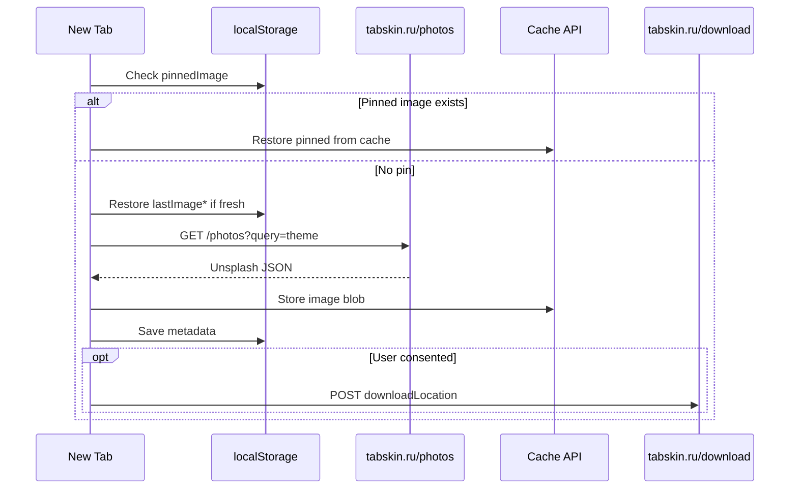

# Tabskin Extension

**[Русская версия](EXTENSION.ru.md)** · [Back to README](../README.md)

This document describes the browser extension architecture, build pipeline, and local storage.

## Overview

The extension overrides the browser new tab page (`chrome_url_overrides.newtab` in `manifest.json`) with a single-page app:

| File | Role |
|------|------|
| `index.html` | New tab markup: clock, controls, attribution, settings trigger |
| `script.js` | Core logic: image fetch, cache, clock, consent, pin, i18n |
| `assets/js/settings.js` | `SettingsManager` class: settings modal UI and persistence |
| `style.css` | Layout, overlays, modals, transitions |
| `_locales/` | Chrome i18n messages for extension name and description |

In development, `index.html` loads `script.js` and `assets/js/settings.js` separately. Production builds bundle both into `app.js`.

## Wallpaper Themes

Theme values are sent as the `query` parameter to `/photos`:

| Value | Label (EN) |
|-------|------------|
| `wallpapers` | Wallpapers |
| `nature` | Nature |
| `render` | 3D Render |
| `textures` | Texture |
| `space` | Space |
| `travel` | Travel |
| `film` | Film |
| `people` | People |
| `architecture` | Architecture |
| `street` | Street Photography |

## User Settings

Stored in `localStorage` under `userSettings` as JSON:

```json
{
  "language": "en",
  "timeFormat": "24",
  "theme": "wallpapers",
  "autoSwitchEnabled": false,
  "autoSwitchIntervalMinutes": 60,
  "transitionEnabled": true,
  "performanceModeEnabled": true
}
```

- **language** — `en` or `ru`; drives in-page translations and consent modal text
- **timeFormat** — `12` or `24`
- **autoSwitchIntervalMinutes** — minimum 15 minutes
- **performanceModeEnabled** — when true, requests smaller Unsplash image URLs

## Local Storage Keys

| Key | Purpose |
|-----|---------|
| `userSettings` | All user preferences |
| `lastImageUrl` | Last loaded image URL |
| `lastImageCreator` | Photographer display name |
| `lastImagePhotoLink` | Unsplash photo page (with UTM) |
| `lastImageCreatorLink` | Unsplash author profile (with UTM) |
| `lastImageLoadTime` | Timestamp of last successful load |
| `userConsentDownloadLocation` | `"true"` when user agreed to download tracking |
| `pinnedImage` | JSON metadata of pinned background |
| `backgroundImageCacheIndex` | JSON array tracking cached image URLs |

Image cache itself lives in the **Cache API** under cache name `background-image-cache`, with a 50 MB size limit and 12-hour TTL per entry.

## Image Loading Flow



## Consent Modal

On first visit, users see a modal explaining that Tabskin sends Unsplash download location data to the server for API compliance. The modal:

- Blocks download tracking until the user clicks Agree
- Supports keyboard focus trap (Tab / Shift+Tab)
- Links to `https://tabskin.ru/privacy.html`

## Pin Background

The pin button (`#pinButton`) saves the current image metadata to `pinnedImage`. While pinned:

- Auto-switch does not replace the background
- Refresh still works but pin state persists until unpinned

## Build Pipeline

Scripts live in `scripts/build-extension.mjs`. Commands:

```bash
npm run build              # Chrome + Firefox, production
npm run build:chrome
npm run build:firefox
npm run dev:chrome         # watch mode, source maps
npm run dev:firefox
npm run validate:extension
npm run icons:generate
```

### Production Build Steps

1. Validate source assets (`validate-extension-assets.mjs`)
2. For each target (`chrome`, `firefox`):
   - Write browser-specific `manifest.json`
   - Replace script tags in `index.html` with single `<script src="app.js">`
   - Bundle and minify JS via esbuild; drop `console` and `debugger`
   - Minify CSS
   - Copy `_locales/` and `assets/` (excluding `assets/js/` and `assets/overlay.png`)
   - Create zip in `artifacts/tabskin-{browser}-v{version}.zip`

### Chrome vs Firefox Manifest

Firefox builds remove `minimum_chrome_version` and add:

```json
"browser_specific_settings": {
  "gecko": {
    "id": "tabskin@tabskin.ru",
    "strict_min_version": "109.0"
  }
}
```

### Watch Mode

`dev:chrome` / `dev:firefox` rebuild on file changes. Changes under `site/`, `server.js`, `dist/`, and `artifacts/` are ignored.

## Asset Validation

`npm run validate:extension` checks that:

- All files referenced in `manifest.json`, `index.html`, and `style.css` exist
- Generated `dist/` packages are complete after build

Do not reference assets that fail validation. Regenerate missing PNG icons with `npm run icons:generate`.

## API Dependency

The extension requires the Tabskin image service:

- `GET https://tabskin.ru/photos?query={theme}&refresh` (optional `refresh` forces bypass)
- `POST https://tabskin.ru/download` with `{ "downloadLocation": "..." }`

Declared in `host_permissions` and CSP `img-src` in `manifest.json`.

## Contributor Checklist

- Edit source in project root only — never hand-edit `dist/`
- Keep Chrome/Firefox differences in the build script, not duplicate manifests
- Run `validate:extension` before committing asset changes
- Test both browsers after changing storage key names (breaks backward compatibility)
