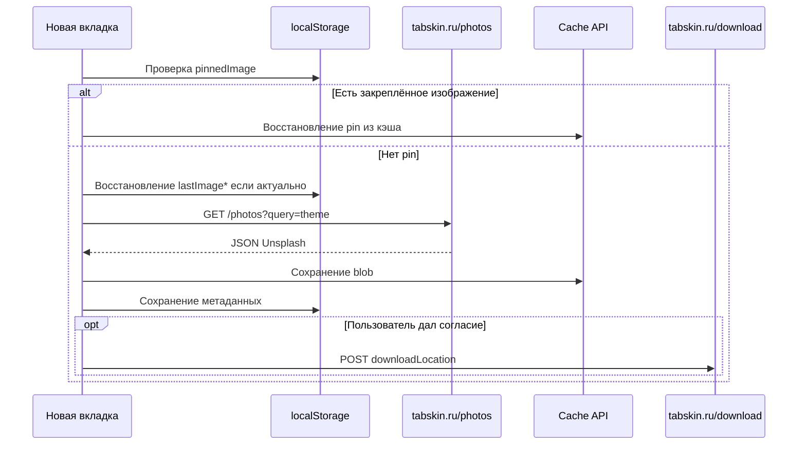

# Расширение Tabskin

**[English version](EXTENSION.md)** · [К README](../README.ru.md)

В этом документе описаны архитектура браузерного расширения, build pipeline и локальное хранилище.

## Обзор

Расширение переопределяет страницу новой вкладки (`chrome_url_overrides.newtab` в `manifest.json`) одностраничным приложением:

| Файл | Назначение |
|------|------------|
| `index.html` | Разметка новой вкладки: часы, кнопки, атрибуция, триггер настроек |
| `script.js` | Основная логика: загрузка изображений, кэш, часы, consent, pin, i18n |
| `assets/js/settings.js` | Класс `SettingsManager`: UI модального окна настроек и сохранение |
| `style.css` | Вёрстка, оверлеи, модальные окна, переходы |
| `_locales/` | Chrome i18n-сообщения для имени и описания расширения |

В разработке `index.html` подключает `script.js` и `assets/js/settings.js` отдельно. В production оба файла объединяются в `app.js`.

## Темы обоев

Значения тем передаются как параметр `query` в `/photos`:

| Значение | Подпись (EN) |
|----------|--------------|
| `wallpapers` | Wallpapers |
| `nature` | Nature |
| `render` | 3D Render |
| `textures` | Texture |
| `space` | Space |
| `travel` | Travel |
| `film` | Film |
| `people` | People |
| `architecture` | Architecture |
| `street` | Street Photography |

## Настройки пользователя

Хранятся в `localStorage` под ключом `userSettings` в формате JSON:

```json
{
  "language": "en",
  "timeFormat": "24",
  "theme": "wallpapers",
  "autoSwitchEnabled": false,
  "autoSwitchIntervalMinutes": 60,
  "transitionEnabled": true,
  "performanceModeEnabled": true
}
```

- **language** — `en` или `ru`; управляет переводами на странице и текстом consent modal
- **timeFormat** — `12` или `24`
- **autoSwitchIntervalMinutes** — минимум 15 минут
- **performanceModeEnabled** — при включении запрашиваются изображения меньшего размера с Unsplash

## Ключи localStorage

| Ключ | Назначение |
|------|------------|
| `userSettings` | Все пользовательские настройки |
| `lastImageUrl` | URL последнего загруженного изображения |
| `lastImageCreator` | Имя фотографа |
| `lastImagePhotoLink` | Страница фото на Unsplash (с UTM) |
| `lastImageCreatorLink` | Профиль автора на Unsplash (с UTM) |
| `lastImageLoadTime` | Время последней успешной загрузки |
| `userConsentDownloadLocation` | `"true"` после согласия на download tracking |
| `pinnedImage` | JSON-метаданные закреплённого фона |
| `backgroundImageCacheIndex` | JSON-массив URL из кэша изображений |

Сам кэш изображений хранится в **Cache API** под именем `background-image-cache`, с лимитом 50 МБ и TTL 12 часов на запись.

## Поток загрузки изображения



## Consent Modal

При первом посещении пользователь видит модальное окно с объяснением, что Tabskin отправляет на сервер download location Unsplash для соблюдения условий API. Модальное окно:

- Блокирует download tracking до нажатия «Согласен»
- Поддерживает focus trap с клавиатуры (Tab / Shift+Tab)
- Ссылается на `https://tabskin.ru/privacy.html`

## Закрепление фона (Pin)

Кнопка pin (`#pinButton`) сохраняет метаданные текущего изображения в `pinnedImage`. Пока фон закреплён:

- Автосмена не заменяет фон
- Refresh по-прежнему работает, но состояние pin сохраняется до открепления

## Build Pipeline

Скрипты в `scripts/build-extension.mjs`. Команды:

```bash
npm run build              # Chrome + Firefox, production
npm run build:chrome
npm run build:firefox
npm run dev:chrome         # watch mode, source maps
npm run dev:firefox
npm run validate:extension
npm run icons:generate
```

### Шаги production-сборки

1. Валидация исходных assets (`validate-extension-assets.mjs`)
2. Для каждой цели (`chrome`, `firefox`):
   - Запись browser-specific `manifest.json`
   - Замена script-тегов в `index.html` на один `<script src="app.js">`
   - Сборка и минификация JS через esbuild; удаление `console` и `debugger`
   - Минификация CSS
   - Копирование `_locales/` и `assets/` (без `assets/js/` и `assets/overlay.png`)
   - Создание zip в `artifacts/tabskin-{browser}-v{version}.zip`

### Manifest: Chrome vs Firefox

Сборки Firefox удаляют `minimum_chrome_version` и добавляют:

```json
"browser_specific_settings": {
  "gecko": {
    "id": "tabskin@tabskin.ru",
    "strict_min_version": "109.0"
  }
}
```

### Watch Mode

`dev:chrome` / `dev:firefox` пересобирают при изменении файлов. Изменения в `site/`, `server.js`, `dist/` и `artifacts/` игнорируются.

## Валидация assets

`npm run validate:extension` проверяет:

- Существование всех файлов из `manifest.json`, `index.html` и `style.css`
- Полноту сгенерированных пакетов в `dist/` после сборки

Не ссылайтесь на assets, не проходящие валидацию. Отсутствующие PNG-иконки перегенерируйте через `npm run icons:generate`.

## Зависимость от API

Расширению нужен сервис изображений Tabskin:

- `GET https://tabskin.ru/photos?query={theme}&refresh` (опциональный `refresh` принудительно обходит кэш)
- `POST https://tabskin.ru/download` с `{ "downloadLocation": "..." }`

Указано в `host_permissions` и CSP `img-src` в `manifest.json`.

## Чеклист для разработчиков

- Редактируйте только исходники в корне — не трогайте `dist/` вручную
- Различия Chrome/Firefox держите в build-скрипте, а не в двух manifest-файлах
- Запускайте `validate:extension` перед коммитом изменений assets
- Тестируйте оба браузера при переименовании ключей хранилища (ломает обратную совместимость)
