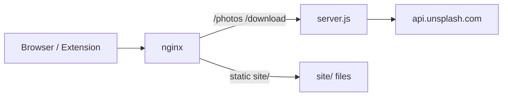

# Tabskin API Server

**[Русская версия](SERVER.ru.md)** · [Back to README](../README.md)

`server.js` is an Express backend that proxies the Unsplash API for the Tabskin extension. It is **not** included in extension packages.

## Purpose

- Fetch random landscape photos from Unsplash by theme query
- Cache API responses in memory to reduce Unsplash rate limit usage
- Rate-limit client requests to `/photos`
- Call Unsplash download location endpoint for API compliance
- Serve static marketing site files from `site/` (development and fallback)

## Routes

### `GET /photos`

Returns a random Unsplash photo JSON for the given theme.

| Query param | Default | Description |
|-------------|---------|-------------|
| `query` | `wallpapers` | Unsplash search query (theme name) |
| `refresh` | — | If present, bypasses server cache and does not update cache |

**Example:**

```http
GET /photos?query=nature
GET /photos?query=wallpapers&refresh
```

**Response:** Unsplash `/photos/random` JSON (landscape orientation).

**Errors:** `500` with `{ "error": "..." }` on Unsplash or internal failures. `429` when rate limit exceeded.

### `POST /download`

Proxies the Unsplash download location call required when a photo is "installed" as wallpaper.

**Request body:**

```json
{
  "downloadLocation": "https://api.unsplash.com/photos/.../download?..."
}
```

**Response:** `{ "success": true }` on success.

**Errors:** `400` if `downloadLocation` missing; `500` on upstream failure.

### Static Files

- `GET /` serves `site/index.html`
- CSS, JS, images under allowed extensions are served from `site/` with cache headers and ETag support
- `express.static` also serves the full `site/` directory

In production, nginx typically handles static files; Node handles API routes.

## Environment Variables

Copy [`.env.example`](../.env.example) to `.env`:

| Variable | Required | Default | Description |
|----------|----------|---------|-------------|
| `UNSPLASH_KEY` | Yes | — | Unsplash API access key |
| `HOST` | No | `127.0.0.1` | Bind address |
| `PORT` | No | `3000` | Listen port |
| `CACHE_TTL` | No | `43200000` (12 h) | In-memory cache TTL in ms |
| `USE_PROXY` | No | `false` | Enable SOCKS5 proxy for Unsplash |
| `PROXY_HOST` | If proxy | — | SOCKS5 host |
| `PROXY_PORT` | No | `1080` | SOCKS5 port |
| `PROXY_USERNAME` | No | — | Proxy auth username |
| `PROXY_PASSWORD` | No | — | Proxy auth password |

The server exits immediately if `UNSPLASH_KEY` is not set.

## Server Dependencies

Server packages are **not** listed in the root `package.json` (which only covers the extension/site build tools). Install separately on the deployment host:

```bash
npm install express cors helmet dotenv node-fetch express-rate-limit cookie-parser socks-proxy-agent
```

## Security

- `helmet()` for HTTP security headers
- Rate limit: **20 requests per hour per IP** on `/photos`
- `trust proxy` enabled for correct client IP behind nginx
- Static file handler blocks path traversal outside `site/`
- CORS: `origin: '*'` with credentials (extension fetches from any origin)

## Caching

Server-side cache is an in-memory `Map` keyed by normalized query string. Cached entries expire after `CACHE_TTL`. Requests with `?refresh` skip cache read and do not write new cache entries.

This is separate from the extension's Cache API and `localStorage` caching.

## Local Development

```bash
cp .env.example .env
# Edit .env and set UNSPLASH_KEY

node server.js
```

Server starts at `http://HOST:PORT`. For local extension testing, temporarily point `IMAGE_API_ENDPOINT` in `script.js` to your local URL or use a hosts/proxy setup.

## Production Deployment

Typical stack:



1. Run `npm run build:site` (builds `site/demo/embed/` and injects SEO heads) and deploy `site/` to the web root
2. Run `node server.js` (or PM2/systemd) behind nginx
3. Proxy `/photos` and `/download` to the Node process
4. Configure SSL for `tabskin.ru`
5. Set `UNSPLASH_KEY` and optional proxy vars in `.env`

Extension `manifest.json` expects:

- `https://tabskin.ru/photos`
- `https://tabskin.ru/download`

## Logging

The server logs timestamped messages for:

- Incoming requests
- Cache hits, misses, and expirations
- Static file serving
- Rate limit violations
- Proxy usage
- Errors on `/photos` and `/download`

## Error Handling

`uncaughtException` and `unhandledRejection` handlers log to stderr. The process does not auto-restart — use a process manager in production.
