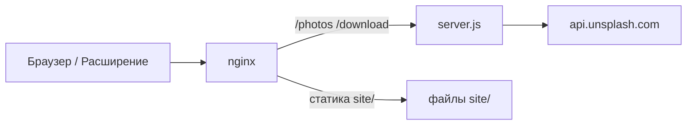

# API-сервер Tabskin

**[English version](SERVER.md)** · [К README](../README.ru.md)

`server.js` — Express-backend, проксирующий Unsplash API для расширения Tabskin. **Не входит** в пакеты расширения.

## Назначение

- Получение случайных landscape-фото с Unsplash по теме (query)
- Кэширование ответов API в памяти для снижения нагрузки на лимиты Unsplash
- Rate limiting запросов к `/photos`
- Вызов Unsplash download location endpoint для соблюдения условий API
- Раздача статики маркетингового сайта из `site/` (разработка и fallback)

## Маршруты

### `GET /photos`

Возвращает JSON случайного фото Unsplash для заданной темы.

| Query-параметр | По умолчанию | Описание |
|----------------|--------------|----------|
| `query` | `wallpapers` | Поисковый запрос Unsplash (имя темы) |
| `refresh` | — | При наличии обходит серверный кэш и не обновляет его |

**Примеры:**

```http
GET /photos?query=nature
GET /photos?query=wallpapers&refresh
```

**Ответ:** JSON эндпоинта Unsplash `/photos/random` (landscape orientation).

**Ошибки:** `500` с `{ "error": "..." }` при сбое Unsplash или внутренней ошибке. `429` при превышении rate limit.

### `POST /download`

Проксирует вызов Unsplash download location, требуемый при «установке» фото как обоев.

**Тело запроса:**

```json
{
  "downloadLocation": "https://api.unsplash.com/photos/.../download?..."
}
```

**Ответ:** `{ "success": true }` при успехе.

**Ошибки:** `400` если `downloadLocation` отсутствует; `500` при сбое upstream.

### Статические файлы

- `GET /` отдаёт `site/index.html`
- CSS, JS, изображения с разрешёнными расширениями — из `site/` с cache headers и ETag
- `express.static` также раздаёт весь каталог `site/`

На production статику обычно обслуживает nginx; Node обрабатывает API-маршруты.

## Переменные окружения

Скопируйте [`.env.example`](../.env.example) в `.env`:

| Переменная | Обязательна | По умолчанию | Описание |
|------------|-------------|--------------|----------|
| `UNSPLASH_KEY` | Да | — | Ключ доступа Unsplash API |
| `HOST` | Нет | `127.0.0.1` | Адрес привязки |
| `PORT` | Нет | `3000` | Порт |
| `CACHE_TTL` | Нет | `43200000` (12 ч) | TTL in-memory кэша в мс |
| `USE_PROXY` | Нет | `false` | Включить SOCKS5-прокси для Unsplash |
| `PROXY_HOST` | При прокси | — | Хост SOCKS5 |
| `PROXY_PORT` | Нет | `1080` | Порт SOCKS5 |
| `PROXY_USERNAME` | Нет | — | Логин прокси |
| `PROXY_PASSWORD` | Нет | — | Пароль прокси |

Сервер завершается сразу, если `UNSPLASH_KEY` не задан.

## Зависимости сервера

Пакеты сервера **не указаны** в корневом `package.json` (там только инструменты сборки расширения/сайта). Устанавливайте отдельно на хосте деплоя:

```bash
npm install express cors helmet dotenv node-fetch express-rate-limit cookie-parser socks-proxy-agent
```

## Безопасность

- `helmet()` для security HTTP-заголовков
- Rate limit: **20 запросов в час с IP** на `/photos`
- `trust proxy` для корректного IP клиента за nginx
- Обработчик статики блокирует path traversal за пределы `site/`
- CORS: `origin: '*'` с credentials (расширение запрашивает с любого origin)

## Кэширование

Серверный кэш — in-memory `Map` с ключом по нормализованному query. Записи истекают после `CACHE_TTL`. Запросы с `?refresh` не читают и не пишут кэш.

Это отдельно от Cache API расширения и кэша в `localStorage`.

## Локальная разработка

```bash
cp .env.example .env
# Укажите UNSPLASH_KEY в .env

node server.js
```

Сервер стартует на `http://HOST:PORT`. Для локального теста расширения временно укажите локальный URL в `IMAGE_API_ENDPOINT` в `script.js` или настройте hosts/proxy.

## Деплой на production

Типичный стек:



1. Запустите `npm run build:site` и задеплойте `site/` в web root
2. Запустите `node server.js` (или PM2/systemd) за nginx
3. Проксируйте `/photos` и `/download` на Node-процесс
4. Настройте SSL для `tabskin.ru`
5. Укажите `UNSPLASH_KEY` и опциональные переменные прокси в `.env`

`manifest.json` расширения ожидает:

- `https://tabskin.ru/photos`
- `https://tabskin.ru/download`

## Логирование

Сервер пишет сообщения с меткой времени для:

- Входящих запросов
- Попаданий, промахов и истечения кэша
- Раздачи статических файлов
- Срабатываний rate limit
- Использования прокси
- Ошибок на `/photos` и `/download`

## Обработка ошибок

Обработчики `uncaughtException` и `unhandledRejection` пишут в stderr. Процесс не перезапускается автоматически — используйте process manager на production.
