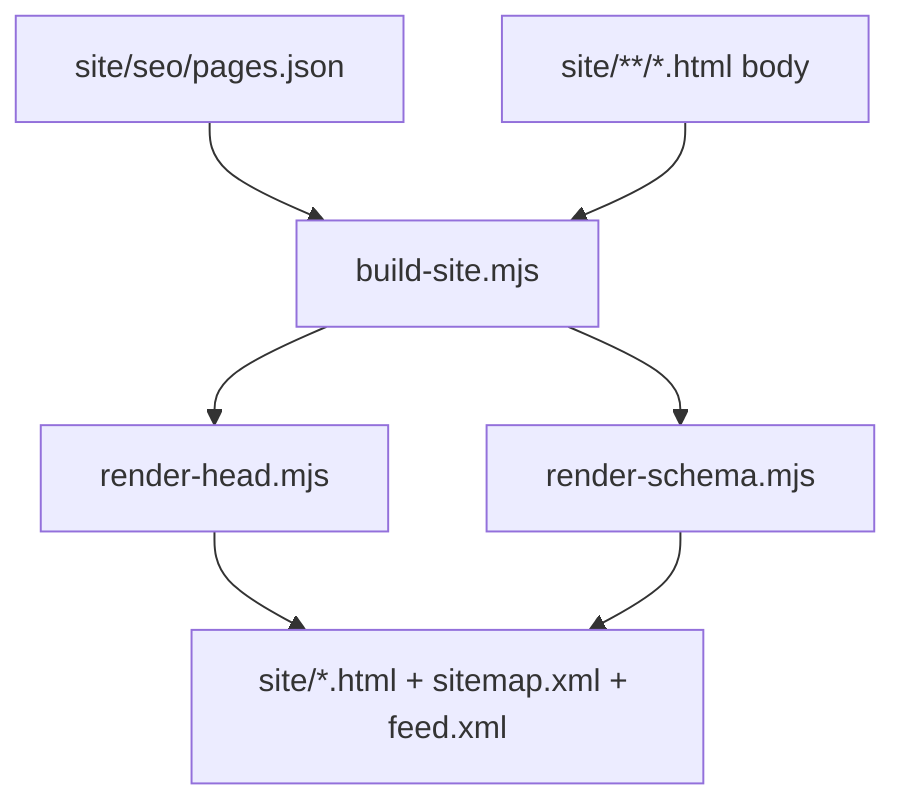

# Tabskin Website

**[Русская версия](SITE.ru.md)** · [Back to README](../README.md)

The `site/` directory is the static marketing website for [tabskin.ru](https://tabskin.ru). It is **not** bundled into the browser extension.

## Site Map

| Path | Language | Purpose |
|------|----------|---------|
| `/` | Russian | Home page |
| `/en/` | English | Home page |
| `/faq/` | Russian | FAQ |
| `/en/faq/` | English | FAQ |
| `/install/chrome/` | Russian | Chrome install guide |
| `/install/firefox/` | Russian | Firefox install guide |
| `/en/install/chrome/` | English | Chrome install guide |
| `/en/install/firefox/` | English | Firefox install guide |
| `/alternatives/` | Russian | Alternative extensions comparison |
| `/en/alternatives/` | English | Alternatives comparison |
| `/blog/` | Russian | Blog index |
| `/en/blog/` | English | Blog index |
| `/blog/*/index.html` | Russian | Blog articles |
| `/en/blog/*/index.html` | English | Blog articles |
| `/privacy.html` | Russian | Privacy policy |
| `/en/privacy.html` | English | Privacy policy |
| `/uninstall.html` | English | Uninstall feedback form (`noindex`) |

RSS feeds:

- `https://tabskin.ru/blog/feed.xml`
- `https://tabskin.ru/en/blog/feed.xml`

## Commands

```bash
npm run build:site       # inject SEO head into all pages + regenerate sitemap
npm run validate:site    # verify required meta tags, hreflang, sitemap
npm run migrate:site-head   # replace <head> blocks with <!-- @head --> marker
```

Typical workflow when editing content:

1. Edit page body in `site/**/*.html`
2. Edit meta, schema, and sitemap settings in `site/seo/pages.json`
3. Run `npm run build:site`
4. Run `npm run validate:site`
5. Deploy `site/` to production

## SEO Build Pipeline



### Configuration: `site/seo/pages.json`

Central registry for every indexed page. Each entry includes:

| Field | Description |
|-------|-------------|
| `path` | Canonical URL path (e.g. `/faq/`) |
| `file` | HTML file relative to `site/` |
| `lang` | Page language (`ru` or `en`) |
| `title`, `description`, `keywords` | Meta tags |
| `alternates` | hreflang map: `ru`, `en`, `xDefault` |
| `schema` | Array of schema builder names (see below) |
| `sitemap` | `changefreq`, `priority`; set `false` to exclude |
| `feed` | Blog RSS entry (`lang`, `title`) |
| `article` | Article dates for JSON-LD and RSS |
| `robots` | Optional override (e.g. `noindex, nofollow`) |

Global defaults live under `defaults` (analytics, OG image, stylesheet, sitemap defaults).

### HTML Head Injection

Page HTML files contain either:

- `<!-- @head -->` marker (preferred after migration), or
- An existing `<head>` block replaced at build time

`scripts/lib/render-head.mjs` generates:

- `<title>`, meta description, keywords, canonical
- Open Graph and Twitter Card tags
- hreflang alternate links
- Google Analytics and Yandex Metrika (when enabled in config)
- JSON-LD `<script type="application/ld+json">` blocks

### JSON-LD Schema Types

Defined in `scripts/lib/render-schema.mjs`:

| Builder name | Schema.org type | Used on |
|--------------|-----------------|---------|
| `softwareApplicationRu` / `En` | SoftwareApplication | Home pages |
| `webSiteRu` / `En` | WebSite | Home pages |
| `faqHomeRu` / `En` | FAQPage | Home pages |
| `faqPageRu` / `En` | FAQPage | FAQ pages |
| `howToChromeRu` / `En` | HowTo | Chrome install guides |
| `howToFirefoxRu` / `En` | HowTo | Firefox install guides |
| `article*` | Article | Blog posts |
| `breadcrumb*` | BreadcrumbList | Nested pages |

Article and breadcrumb builders receive page-specific data from `pages.json`.

### Generated Files

`npm run build:site` also writes:

- `site/sitemap.xml` — all indexed pages with hreflang
- `site/blog/feed.xml` and `site/en/blog/feed.xml` — RSS from blog entries

## Static Assets

- `site/assets/` — screenshots, browser logos, logo
- `site/styles.css` — shared site stylesheet
- `site/translations.js` — client-side language switcher for marketing copy
- Favicons and PWA icons in `site/` root

## Related Docs

- [site/templates/README.md](../site/templates/README.md) — template reference
- [site/seo/post-deploy.md](../site/seo/post-deploy.md) — post-deploy SEO checklist
- [site/seo/audit.md](../site/seo/audit.md) — SEO audit notes
- [site/seo-keywords.json](../site/seo-keywords.json) — keyword clusters for monitoring

## Production Deployment

In production, static files are served by **nginx** in front of Node.js. The Express server in `server.js` also serves `site/` for local development.

API routes (`/photos`, `/download`) are proxied separately — see [SERVER.md](SERVER.md).

After deploying site changes, follow [site/seo/post-deploy.md](../site/seo/post-deploy.md): Rich Results Test, OG debugger, PageSpeed, Search Console, Yandex Webmaster.

## Validation Rules

`npm run validate:site` checks each page in `pages.json` for:

- Required meta tags (title, description, canonical, OG, Twitter, theme-color)
- hreflang symmetry between RU/EN alternates
- Sitemap includes all indexed pages
- Feed XML is well-formed

Fix any reported errors before deploying.
