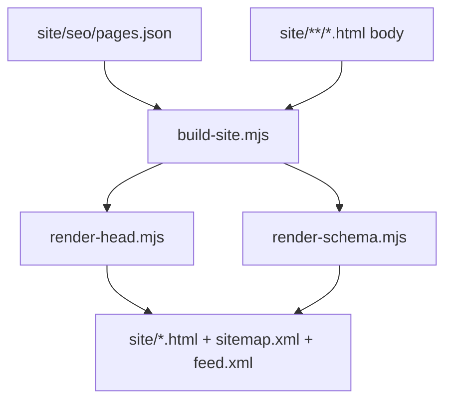

# Сайт Tabskin

**[English version](SITE.md)** · [К README](../README.ru.md)

Папка `site/` — статический маркетинговый сайт [tabskin.ru](https://tabskin.ru). Он **не входит** в пакеты браузерного расширения.

## Карта сайта

| Путь | Язык | Назначение |
|------|------|------------|
| `/` | Русский | Главная |
| `/en/` | English | Главная |
| `/faq/` | Русский | FAQ |
| `/en/faq/` | English | FAQ |
| `/install/chrome/` | Русский | Установка в Chrome |
| `/install/firefox/` | Русский | Установка в Firefox |
| `/en/install/chrome/` | English | Установка в Chrome |
| `/en/install/firefox/` | English | Установка в Firefox |
| `/alternatives/` | Русский | Сравнение с альтернативами |
| `/en/alternatives/` | English | Сравнение с альтернативами |
| `/blog/` | Русский | Индекс блога |
| `/en/blog/` | English | Индекс блога |
| `/blog/*/index.html` | Русский | Статьи блога |
| `/en/blog/*/index.html` | English | Статьи блога |
| `/privacy.html` | Русский | Политика конфиденциальности |
| `/en/privacy.html` | English | Privacy policy |
| `/uninstall.html` | English | Форма обратной связи при удалении (`noindex`) |

RSS-ленты:

- `https://tabskin.ru/blog/feed.xml`
- `https://tabskin.ru/en/blog/feed.xml`

## Команды

```bash
npm run build:site       # вставка SEO head на все страницы + пересборка sitemap
npm run validate:site    # проверка meta-тегов, hreflang, sitemap
npm run migrate:site-head   # замена <head> на маркер <!-- @head -->
```

Типичный workflow при редактировании контента:

1. Редактировать тело страницы в `site/**/*.html`
2. Редактировать мета, schema и sitemap в `site/seo/pages.json`
3. Запустить `npm run build:site`
4. Запустить `npm run validate:site`
5. Задеплоить `site/` на production

## SEO Build Pipeline



### Конфигурация: `site/seo/pages.json`

Центральный реестр всех индексируемых страниц. Каждая запись содержит:

| Поле | Описание |
|------|----------|
| `path` | Канонический URL-путь (например `/faq/`) |
| `file` | HTML-файл относительно `site/` |
| `lang` | Язык страницы (`ru` или `en`) |
| `title`, `description`, `keywords` | Meta-теги |
| `alternates` | Карта hreflang: `ru`, `en`, `xDefault` |
| `schema` | Массив имён schema builders (см. ниже) |
| `sitemap` | `changefreq`, `priority`; `false` — исключить из sitemap |
| `feed` | Запись RSS блога (`lang`, `title`) |
| `article` | Даты статьи для JSON-LD и RSS |
| `robots` | Опциональное переопределение (например `noindex, nofollow`) |

Глобальные значения по умолчанию — в `defaults` (аналитика, OG-изображение, stylesheet, sitemap).

### Вставка HTML Head

HTML-файлы страниц содержат:

- маркер `<!-- @head -->` (предпочтительно после миграции), или
- существующий блок `<head>`, заменяемый при сборке

`scripts/lib/render-head.mjs` генерирует:

- `<title>`, meta description, keywords, canonical
- Open Graph и Twitter Card
- hreflang alternate links
- Google Analytics и Яндекс Метрику (если включены в конфиге)
- JSON-LD `<script type="application/ld+json">`

### Типы JSON-LD Schema

Определены в `scripts/lib/render-schema.mjs`:

| Имя builder | Тип Schema.org | Где используется |
|-------------|----------------|------------------|
| `softwareApplicationRu` / `En` | SoftwareApplication | Главные страницы |
| `webSiteRu` / `En` | WebSite | Главные страницы |
| `faqHomeRu` / `En` | FAQPage | Главные страницы |
| `faqPageRu` / `En` | FAQPage | Страницы FAQ |
| `howToChromeRu` / `En` | HowTo | Инструкции Chrome |
| `howToFirefoxRu` / `En` | HowTo | Инструкции Firefox |
| `article*` | Article | Статьи блога |
| `breadcrumb*` | BreadcrumbList | Вложенные страницы |

Article и breadcrumb builders получают данные страницы из `pages.json`.

### Генерируемые файлы

`npm run build:site` также записывает:

- `site/sitemap.xml` — все индексируемые страницы с hreflang
- `site/blog/feed.xml` и `site/en/blog/feed.xml` — RSS из записей блога

## Статические ресурсы

- `site/assets/` — скриншоты, логотипы браузеров, логотип Tabskin
- `site/styles.css` — общие стили сайта
- `site/translations.js` — переключатель языка для маркетингового текста
- Favicon и PWA-иконки в корне `site/`

## Связанные документы

- [site/templates/README.md](../site/templates/README.md) — справка по шаблонам
- [site/seo/post-deploy.md](../site/seo/post-deploy.md) — чеклист SEO после деплоя
- [site/seo/audit.md](../site/seo/audit.md) — заметки SEO-аудита
- [site/seo-keywords.json](../site/seo-keywords.json) — кластеры ключевых слов для мониторинга

## Деплой на production

На production статика отдаётся через **nginx** перед Node.js. Express-сервер в `server.js` также раздаёт `site/` для локальной разработки.

API-маршруты (`/photos`, `/download`) проксируются отдельно — см. [SERVER.ru.md](SERVER.ru.md).

После деплоя изменений сайта следуйте [site/seo/post-deploy.md](../site/seo/post-deploy.md): Rich Results Test, OG debugger, PageSpeed, Search Console, Яндекс Вебмастер.

## Правила валидации

`npm run validate:site` проверяет каждую страницу из `pages.json`:

- Обязательные meta-теги (title, description, canonical, OG, Twitter, theme-color)
- Симметрию hreflang между RU/EN alternates
- Наличие всех индексируемых страниц в sitemap
- Корректность XML лент RSS

Исправьте ошибки перед деплоем.
